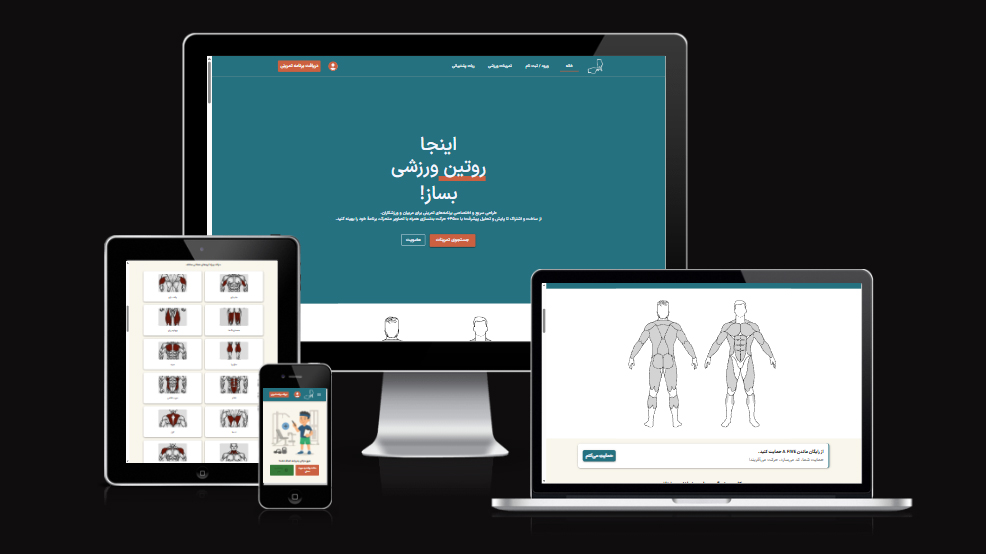
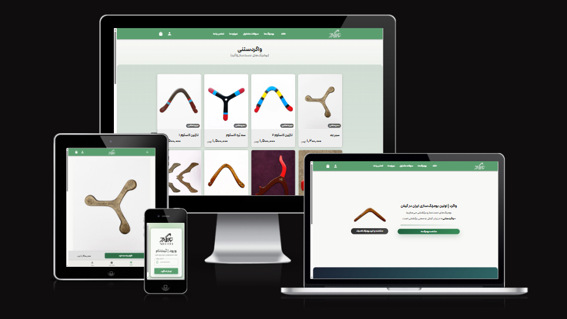
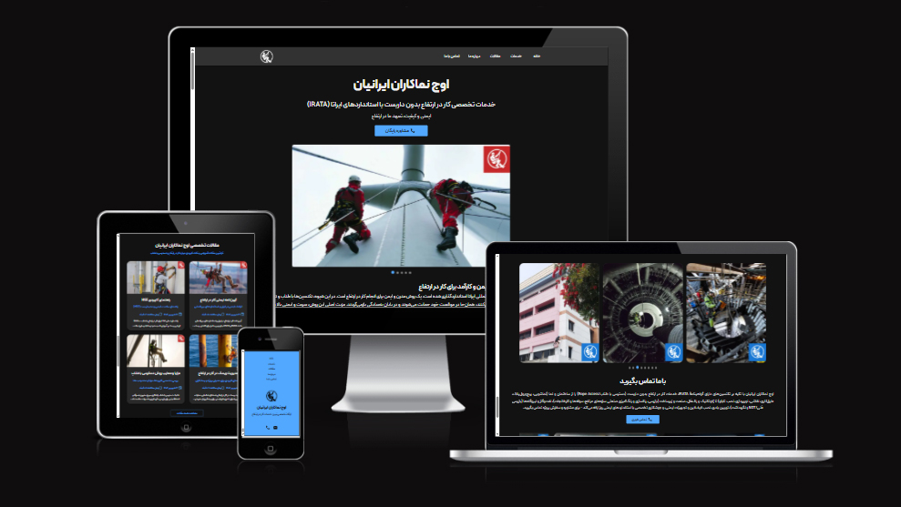

# Hi there, I’m Amin Pournaghi  

🎯 Front-End Developer (React.js / Next.js) 

---

## About Me  
Front-End Developer with +2 years of experience building scalable web applications using **React.js and Next.js**, with a strong focus on **FitnessTech and HealthTech systems**. Experienced in **Node.js (Express.js)** for backend integration, with practical knowledge of Docker, Nginx, and Ubuntu-based production environments. 

---

## Tech Stack  

### Front-end Development (Core)

### Back-end Development

### DevOps & Tools 

---

## Featured Projects  

### [A-FIVE — HealthTech Platform](https://www.a-five.ir) — Jan 2024 – Jun 2026   
Designed and developed a full-stack HealthTech platform for workout planning, tracking, and performance analytics for athletes and coaches using React.js, TypeScript, Express.js, and MongoDB, deployed on Ubuntu VPS with Docker and Nginx reverse proxy.

**Highlights**  
- **Workout Plan Studio**  
  Reduced workout program creation time by **75%** through optimized UI workflows. 
- **Advanced Exercise Search**  
  Built a high-performance filtering system with 4,500+ exercises and reducing search time by **60%**.
- **AI Coaching Assistant**  
  Developed an LLM-powered chatbot that guides users and provides training support. 
- **Workout Tracking & Analytics**  
  Generated automated **weekly, monthly performance reports** with visual insights.  
- **Secure Backend APIs**  
  Built REST APIs with **JWT authentication and role-based access**.
- **Infrastructure & Deployment**  
  Containerized services using **Docker & Docker Swarm**, deployed on Linux servers with **Nginx reverse proxy and SSL**.

  

---

### [Vagard](https://www.vagard.ir) — Nov 2025 – May 2026 
Developed a full-stack **e-commerce platform** for handcrafted wooden boomerangs using Next.js, Express.js, MongoDB, Redux, and MUI.

**Highlights**  
- Implemented full **shopping flow** (product listing, product detail pages, cart, checkout, payment).
- Built **OTP-based mobile authentication** for fast user onboarding.
- Created a **mobile-first responsive UI** optimized for usability.

  

---

### [Owj Namakaran](https://www.owjnamakaran.ir) — Sep 2024 – Oct 2025
**Corporate website** for rope-access & industrial services.  

**Highlights**  
Designed and launched a **corporate website** using Next.js and MUI with a modern, fully responsive multi page UI/UX. Produced all article and page content, improved SEO using SSR/SSG and Google Search Console, and deployed the site with Docker to enhance visibility, branding, and client engagement. 

  

---

## Education  

**M.Sc. in Applied Exercise Physiology** — University of Guilan, Rasht (2021–2024)  
- GPA: 17.9 / 20  
- Rank: 2/12  
- **Master’s Thesis:** *Comparison of the Effect of Caffeine and Nap Opportunity on Sport-Cognitive Performance, Sleepiness, and Mood in Youth Soccer Players*  

**B.Sc. in Sport Sciences** — University of Guilan, Rasht (2017–2021)  
- GPA: 18.35 / 20  
- Rank: 5/120  

**Diploma in Math & Physics** — Beheshti High School, Rasht (2012–2015)  

---

## Courses & Certifications  
- Front-End Development with React — Quera College  
- Web Design & Development (HTML/CSS/JS) — Quera College  
- Fundamentals of Python Programming (Task-Oriented) — Quera College
- Task-Oriented Course In SQL - Quera College 

---

## Honors & Awards  
- Gifted Talent Admission — Top M.Sc. Applicant, University of Guilan (2021)
- Professional Football Player – Former Player in Persian Gulf Pro League
- Former Member of Iran National Football Team (U15)

---

## 📫 Let’s Connect  
- 💼 [LinkedIn](https://www.linkedin.com/in/amin-pournaghi)
- ✉️ [Email](mailto:aminpournaghii5@gmail.com)
